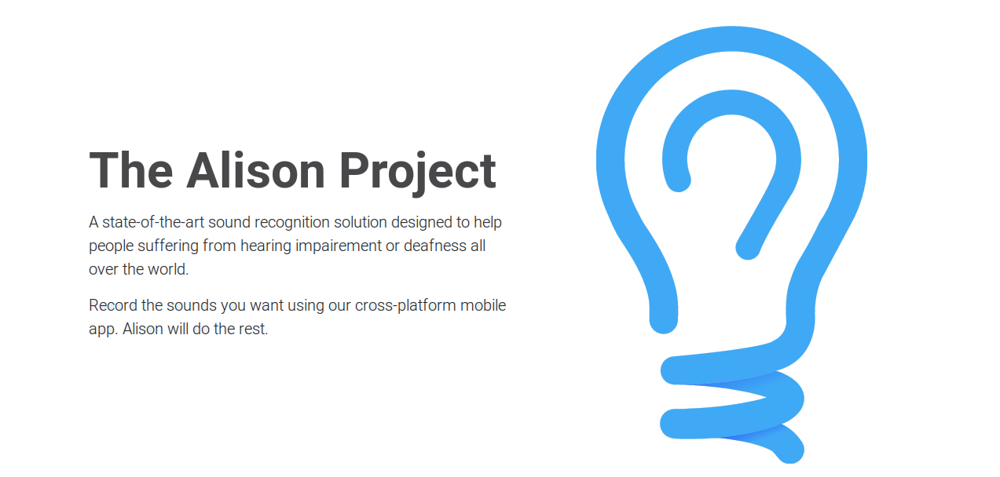

# Alison Project



This README is also available in : , 

---

## Work on the project

If you have no IDE to manage the project, you can still install some tools to help you.

First, if you don't have it, install `virtualenv`

```
pip3 install virtualenv
```

Running the script `scripts/init.sh` will then setup virtualenv and install all the requirements for the project.

Then you can use `scripts/format.sh` to format the whole project, and `pylint alison` to spot errors and bad practices in your code.

### Manage your virtual environment

When you run `scripts/init.sh` it exits with the virtual environment activated. To deactivate it, simply type `deactivate` in a terminal.
To reactivate it you just have to run the following command from the root of the project:

```
source env/bin/activate
```

## POUR LA DEMO

La commande à lancer est

```
python3 -m alison --dict samples/sample.dict
```

Le Raspi est suuuuuper lent donc c'est possible de run NMF mais ça met qqs minutes. La commande
ci-dessus le run avec un dictionnaire précalculé, ça permet d'éviter d'attendre 5 minutes à chaque
fois qu'on veut tester.

Pour run sans dictionnaire

```
python3 -m alison
```

Si vous avez une erreur mentionnant un `positive_code`, alors c'est que la version de
scikit learn est pas à jour. Il faut le mettre à jour vers la version 0.20. Si c'est
pas possible, alors vous pouvez supprimer le paramètre `positive_code` dans nmf.py. Mais
ça marche beaucoup moins bien (les résultats ont l'air vraiment random)

Vous pouvez bidouiller le `threshold`  dans recognizer.py pour que ça marche mieux, ça correspond
aux valeurs qui sont affichées quand un son est reconnu

Pour run les démos qui marchaient

```
python3 -m alison --dict samples/sample.dict --file <fichier à tester>
```
